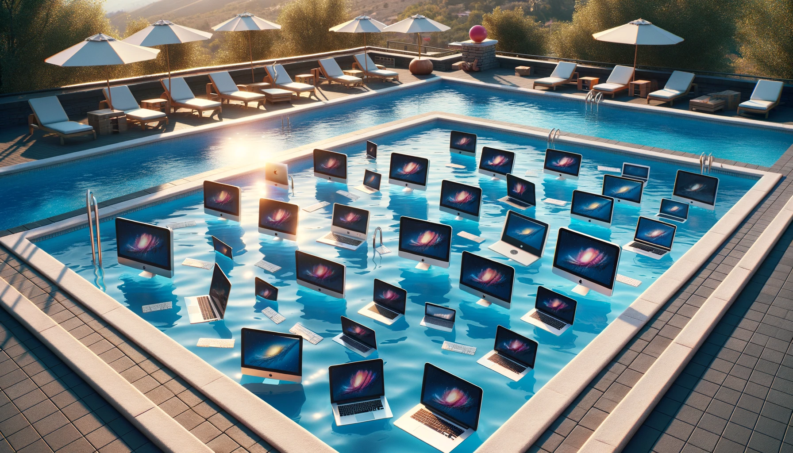

<h1>Piscine 42 Paris - August 2023</h1>

---

<h1>Level: 11.80 :chart_with_upwards_trend:</h1>

 

## Projects

| Project  | Subject | Completion % |
| -------- |:-------------:|:-------------:| 
| [shell00](https://github.com/chlimous/42-piscine/tree/main/shell00)  | [Subject](https://github.com/chlimous/42-piscine/blob/main/shell00/subject.pdf) | :white_check_mark: 100           |
| [shell01](https://github.com/chlimous/42-piscine/tree/main/shell01)  | [Subject](https://github.com/chlimous/42-piscine/blob/main/shell01/subject.pdf) | :white_check_mark: 100           |
| [C00](https://github.com/chlimous/42-piscine/tree/main/c00)      | [Subject](https://github.com/chlimous/42-piscine/blob/main/c00/subject.pdf) | :white_check_mark: 100           |
| [C01](https://github.com/chlimous/42-piscine/tree/main/c01)      | [Subject](https://github.com/chlimous/42-piscine/blob/main/c01/subject.pdf) | :white_check_mark: 100           |
| [C02](https://github.com/chlimous/42-piscine/tree/main/c02)      | [Subject](https://github.com/chlimous/42-piscine/blob/main/c02/subject.pdf) | :white_check_mark: 85            |
| [C03](https://github.com/chlimous/42-piscine/tree/main/c03)      | [Subject](https://github.com/chlimous/42-piscine/blob/main/c03/subject.pdf) | :white_check_mark: 100           |
| [C04](https://github.com/chlimous/42-piscine/tree/main/c04)      | [Subject](https://github.com/chlimous/42-piscine/blob/main/c04/subject.pdf) | :white_check_mark: 100           |
| [C05](https://github.com/chlimous/42-piscine/tree/main/c05)      | [Subject](https://github.com/chlimous/42-piscine/blob/main/c05/subject.pdf) | :white_check_mark: 100           |
| [C06](https://github.com/chlimous/42-piscine/tree/main/c06)      | [Subject](https://github.com/chlimous/42-piscine/blob/main/c06/subject.pdf) | :white_check_mark: 100           |
| [C07](https://github.com/chlimous/42-piscine/tree/main/c07)      | [Subject](https://github.com/chlimous/42-piscine/blob/main/c07/subject.pdf) | :white_check_mark: 100           |
| [C08](https://github.com/chlimous/42-piscine/tree/main/c08)      | [Subject](https://github.com/chlimous/42-piscine/blob/main/c08/subject.pdf) | :white_check_mark: 100           |
| [C09](https://github.com/chlimous/42-piscine/tree/main/c09)      | [Subject](https://github.com/chlimous/42-piscine/blob/main/c09/subject.pdf) | :white_check_mark: 100           |
| [C11](https://github.com/chlimous/42-piscine/tree/main/c11)      | [Subject](https://github.com/chlimous/42-piscine/blob/main/c11/subject.pdf) | :white_check_mark: 100 (fixed)   |
| [rush00](https://github.com/chlimous/42-piscine/tree/main/rush00)   |  | :white_check_mark: 120           |
| [rush01](https://github.com/chlimous/42-piscine/tree/main/rush01)   |  | :white_check_mark: 110           |
| [rush02](https://github.com/chlimous/42-piscine/tree/main/rush02)   |  | :white_check_mark: 90            |
| [BSQ](https://github.com/chlimous/42-piscine/tree/main/bsq) (with [lquehec](https://github.com/lxup))      |    | :white_check_mark: 100           |

---

<a href="https://profile.intra.42.fr/users/chlimous">chlimous</a>

